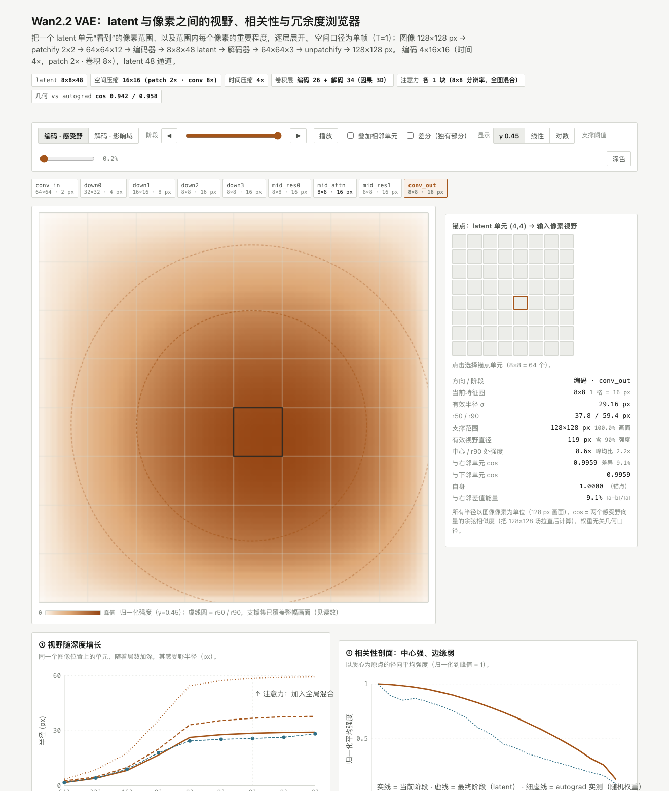
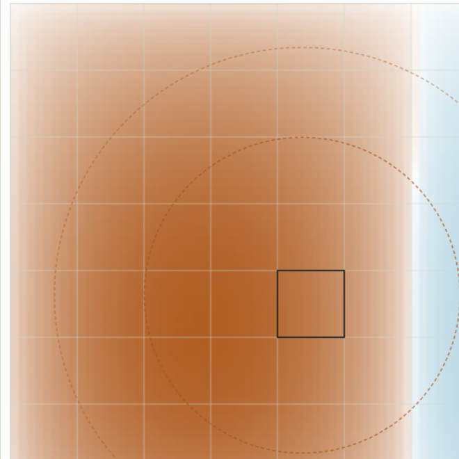
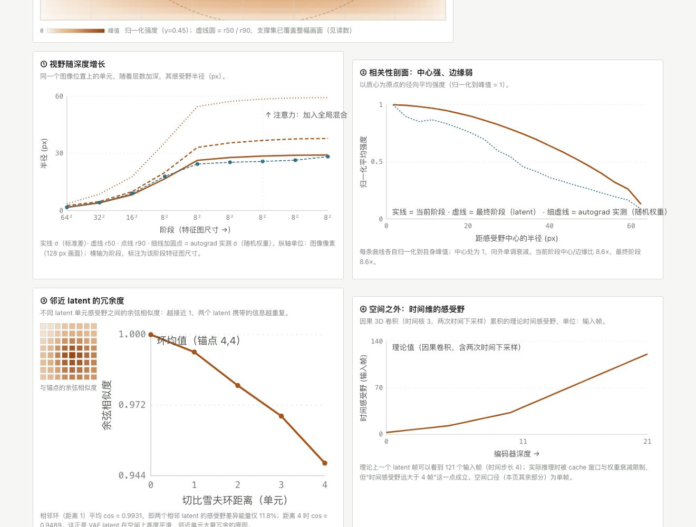

# Wan2.2 VAE 感受野 / 影响域浏览器

把一个 latent 单元"看到"的像素范围、范围内每个像素的重要程度、以及相邻 latent 之间的冗余度，逐层动态展开。针对 **Wan2.2 VAE**（`AutoencoderKLWan`：`base_dim=160 / decoder_base_dim=256 / z_dim=48 / patch_size=2 / is_residual=True / temperal_downsample=[T,T,F]`，即 4×16×16 压缩、48 通道 latent）。

**打开 [`vae_rf_explorer.html`](vae_rf_explorer.html) 即可使用**——单文件、离线、零依赖（无 CDN、无构建步骤）。左侧画布上拖时间轴或点"播放"，就能看到视野逐层长出来。



---

## 一、它把三件容易混在一起的事拆开画

| 想看的现象 | 面板 | 在 Wan2.2 VAE 上的实测结果 |
|---|---|---|
| 视野逐层变大 | ① 视野随深度增长 | **支撑集**（强度非零范围）在第三个下采样块（即 8×8 latent 分辨率）就已覆盖整幅 128 px；**有效**视野继续长：σ = 1.7 → 4.0 → 8.3 → 16.7 → 26.4 → **29.2 px**，r90 = 3.5 → 8.6 → 17.7 → 35.7 → 54.6 → **59.4 px**（含 90% 强度的直径 ≈ 119 px） |
| 核心相关性更强、边缘更弱 | ② 相关性剖面 | 径向平均强度是平滑钟形；**中心 / r90 处 = 8.6×**，峰均比 2.2×（随机权重下 5.3×） |
| 邻近 latent 数值高度相似 | ③ 邻近 latent 的冗余度 | 相邻单元感受野 **cos = 0.9959**（差异能量 ‖a−b‖/‖a‖ 仅 9.1%）；切比雪夫环 1 平均 0.9931，环 4 降到 0.9489 |

另外两个面板：

- **④ 空间之外：时间维**——因果 3D 卷积（时间核 3、两次时间下采样）累积的理论时间感受野：一个 latent 帧可见约 **121 个输入帧**（时间步长 4），远不止"4 帧"。
- **⑤ 方法与口径**——层清单、假设、验证表、复现命令。

## 二、交互

- **编码 · 感受野 / 解码 · 影响域**：同一套几何的正反两个方向。编码方向是"latent 单元 ← 输入像素"（反向传播），解码方向是"latent 单元 → 输出像素"（前向传播 / 影响锥）；再切到输出像素就得到"它依赖哪些 latent"。
- **阶段**：`conv_in → down0..down3 → mid_res0 → mid_attn → mid_res1 → conv_out`（解码为 `conv_in → mid_* → up0..up3 → conv_out`），滑杆、◀▶、播放、或点阶段条。
- **锚点**：点右侧 8×8 网格任选 latent 单元（64 个）。
- **叠加相邻单元**：锚点热图 + 与右邻差异超过峰值 5% 的薄区 + 右邻 r90 虚线圆——两个圆几乎重合，差异只是一弯细月牙。
- **差分（独有部分）**：发散配色的 `锚点 − 右邻` 偶极子，暖色 = 锚点独有、冷色 = 右邻独有。



- **显示尺度**：γ0.45 / 线性 / 对数。路径计数的动态范围很大，线性显示只会看到一个亮点——这也是"边缘相关性弱"最容易被看漏的地方。
- **支撑阈值**：画支撑轮廓的阈值（默认 0.2% 峰值）。右键不必，鼠标悬停画布读任意像素强度与距中心距离。



## 三、数字是怎么算出来的

**几何口径（权重无关）。** 强度用**路径计数线性化**：把每个 3×3 卷积、每条残差/捷径支路（`AvgDown3D` / `DupUp3D`）按等权展开，只依赖网络几何——核大小、步长、填充、支路结构、patchify 2×2、因果时间填充。核/步长/填充直接从真实 diffusers 模块读取，所以换 checkpoint 后几何会自动重建。注意力块按"残差 + 全图平均"处理（权重无关口径下唯一自然的选择，会在局部 blob 之外加一层很低的全局底噪）。

**独立验证。** 在随机初始化的 Wan2.2 VAE 上用两条独立路径对拍（`probe_rf.py`）：

| 几何量 | 独立实测 | 一致性 |
|---|---|---|
| 编码：latent 单元 → 输入像素 | autograd 梯度 | cos **0.9419** |
| 解码：latent 单元 → 输出像素 | 前向扰动 \|Δ输出\| | cos **0.8059** |
| 解码：输出像素 → latent | autograd 梯度 | cos **0.9580** |
| 逐层 σ（conv_in → conv_out） | autograd 梯度 | cos 0.88 – 0.98 |

浏览器里的 JS 实现与 Python 参考实现逐元素对拍 21 组用例，**最大相对误差 3.4e-16**（`node test_engine.js`），所以页面上的曲线是计算值而非示意图。

**已知近似**：① 路径计数是线性化，不含训练后权重的重心偏移；② 注意力按均匀混合处理；③ autograd 对照使用**随机权重**而非训练权重。

## 四、复现

```bash
pip install -r requirements.txt          # torch, diffusers, numpy

python probe_rf.py                       # 几何 DP + autograd/扰动验证 → probe_summary.json
python build_html.py                     # 把几何与验证数据内联进单文件 HTML
python dump_reference.py && node test_engine.js   # JS 引擎 vs Python 参考实现对拍
```

**换成训练后的真实权重**（几何部分会自动按 checkpoint 的 `patch_size` 与残差块结构重建；会变的是强度分布形状）：

```bash
python probe_rf.py --vae-path /path/to/pretrained/model/vae
python build_html.py
```

## 五、文件

| 文件 | 说明 |
|---|---|
| `vae_rf_explorer.html` | 交付物：单文件交互页面（已内联几何引擎与验证数据） |
| `probe_rf.py` | 几何 DP（编码 RF / 解码影响域 / 解码依赖）+ autograd 与前向扰动验证，支持 `--vae-path` |
| `rf_engine.js` | 浏览器端同一套几何（node 与浏览器通用，无依赖） |
| `ui_template.html` | 页面模板（样式 + 交互 + 图表） |
| `build_html.py` | 用 `rf_engine.js` + `probe_summary.json` 生成 `vae_rf_explorer.html` |
| `dump_reference.py` | 导出 Python 参考场，供 JS 对拍 |
| `test_engine.js` | 对拍脚本（21 组用例） |
| `probe_summary.json` | 验证数据（各阶段 σ/r50/r90、径向剖面、相似度矩阵、时间感受野） |
| `ref_cases.json` | 对拍用例（由 `dump_reference.py` 生成，约 4.8 MB） |

## 六、适用边界

- 空间口径为**单帧**（T=1），时间维单独一块；因果时间填充不影响空间视野。
- 数字针对 128×128 输入（→ 8×8 latent）。其它分辨率下 latent 网格数不同，但**半径的 px 数值几乎不变**（几何是局部的，边界效应除外）。
- 结论对应 Wan2.2-VAE 这一档（有 patchify 2×2、残差下/上采样块）；换成 Wan2.1 风格（无 patchify、`is_residual=False`）时阶段结构会变，脚本会按 checkpoint 重建，但页面上的 8×8×48 标注需要重新构建。

## License

本目录代码为 MIT，见 [LICENSE](LICENSE)；仓库其余部分遵循上游项目的 Apache-2.0（`LICENSE.txt`）。
